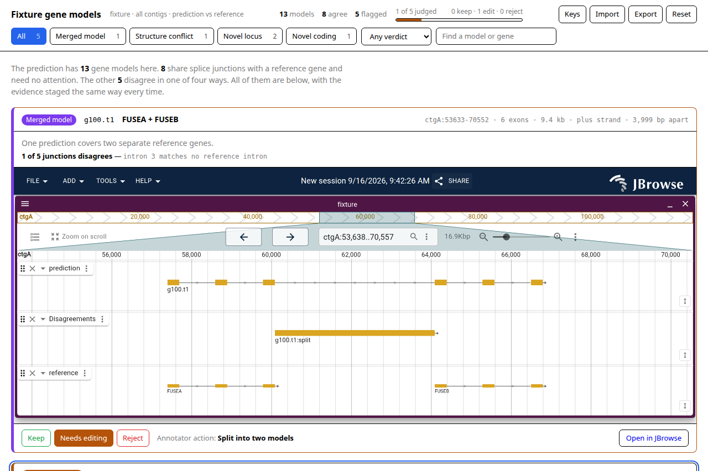
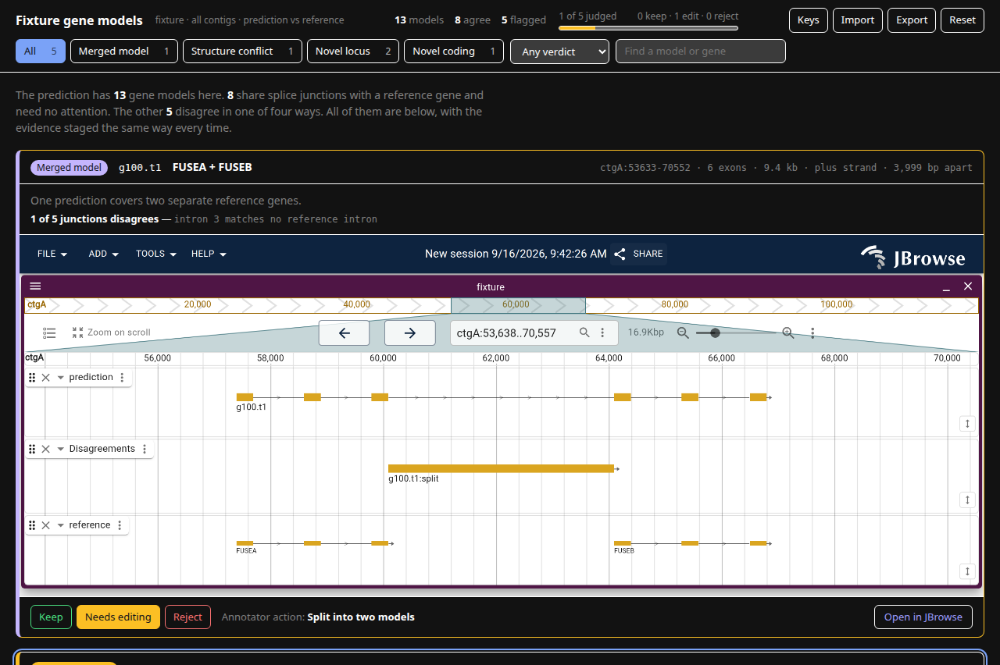

# gene-review-portal

Turn a gene prediction, a reference annotation and a genome into a **static
review portal**: a page of the predicted models that disagree with the
reference, each with a JBrowse screenshot of the locus, a verdict, and a link
that opens the same view live.

A gene finder returns tens of thousands of models and no way to tell which are
wrong. Comparing them against an existing annotation sorts the disagreements
into four kinds, and only those need a person.

```bash
gene-review-portal \
  --prediction tiberius.gff3 \
  --reference gencode.v49.gff3 \
  --fasta GRCh38.fa \
  --rnaseq rnaseq.bam \
  --assembly hg38 --region chr22 \
  --with-app --out ./portal

npx serve ./portal
```

Live example, built from the command in
[`demos/`](https://jbrowse.org/demos/tiberius_review/): Tiberius on human
chr22, read against the hub's GENCODE 49.



The page follows the reader's theme, so the same portal is legible either way:



Both are `pnpm test`'s own fixture, captured against a local JBrowse build —
`docs/shoot.mjs` rebuilds them.

## Install

```bash
pnpm install
```

React, react-dom and esbuild build the review page. The other dependency is
[`@jbrowse/capture`](https://github.com/GMOD/jbrowse-components/tree/main/products/jbrowse-capture),
which is what knows when a JBrowse has actually finished drawing — the
difference between a directory of screenshots and a directory of pictures of
empty browsers. It is not on npm yet, so `package.json` links it out of a
jbrowse-components checkout beside this one:

```
~/src/jbrowse-components
~/src/gene-review-portal
```

Point the link somewhere else, or drop the dependency and run with
`--no-capture`, which builds the same page with links and no pictures.

Also needed on PATH: `bgzip`, `tabix` and `samtools` (htslib + samtools), plus
the `jbrowse` CLI (`npm i -g @jbrowse/cli`) for `--with-app`.

## What comes out

```
portal/
  index.html      the review page — filters, verdicts, export
  config.json     a JBrowse config naming the data below
  data/           bgzipped and indexed copies of your inputs, plus
                  conflicts.bed — every junction that differs
  img/            one capture per candidate
  jbrowse/        JBrowse itself, with --with-app
```

Nothing points outside the directory, so `aws s3 sync portal/ s3://…` is the
whole deployment.

## Reviewing

The queue is meant to be read one card at a time, so it takes the keyboard:
<kbd>j</kbd> and <kbd>k</kbd> move, <kbd>1</kbd> <kbd>2</kbd> <kbd>3</kbd> are
keep / needs editing / reject on the card under the cursor, <kbd>o</kbd> opens it
in JBrowse and <kbd>/</kbd> jumps to the search box. The same digit twice takes a
verdict back off. **Keys** in the toolbar, or <kbd>?</kbd>, shows the list.

Set **Unreviewed** as the verdict filter and the queue drains as it is judged,
the cursor closing over each card that leaves.

Verdicts live in the reviewer's browser (`localStorage`), which is one browser on
one machine: **Export** writes them out as TSV to hand back to a
pipeline, and **Import** reads that TSV back, so a second reviewer, a second
laptop or a cleared site setting is not a review started again from nothing.

## Documentation

- [How the page is built](docs/architecture.md) — the React/esbuild pipeline,
  and staging a track's display settings into both the capture and the link
- [How a model gets flagged](docs/classification.md) — the classifier, and
  where each disagreement is marked in `conflicts.bed`
- [Evidence and Apollo](docs/evidence-and-apollo.md) — `--rnaseq`, and handing
  a flagged model to an annotation editor
- [Flags worth knowing](docs/flags.md)
- [Naming an assembly instead of assembling one](docs/hubs.md) — `--hub` and
  `--reference-track`
- [Test](docs/testing.md) — `pnpm test`

## License

Apache-2.0. Extracted from
[jbrowse-components](https://github.com/GMOD/jbrowse-components), where it lives
as `demo/tiberius-portal`.
